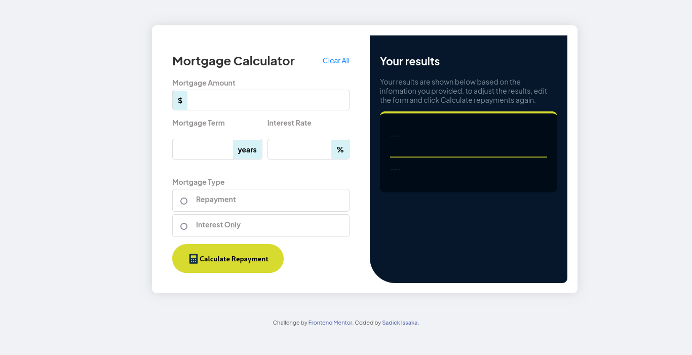
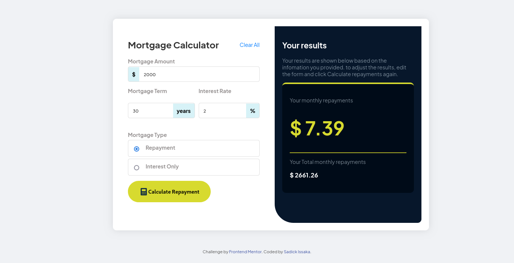
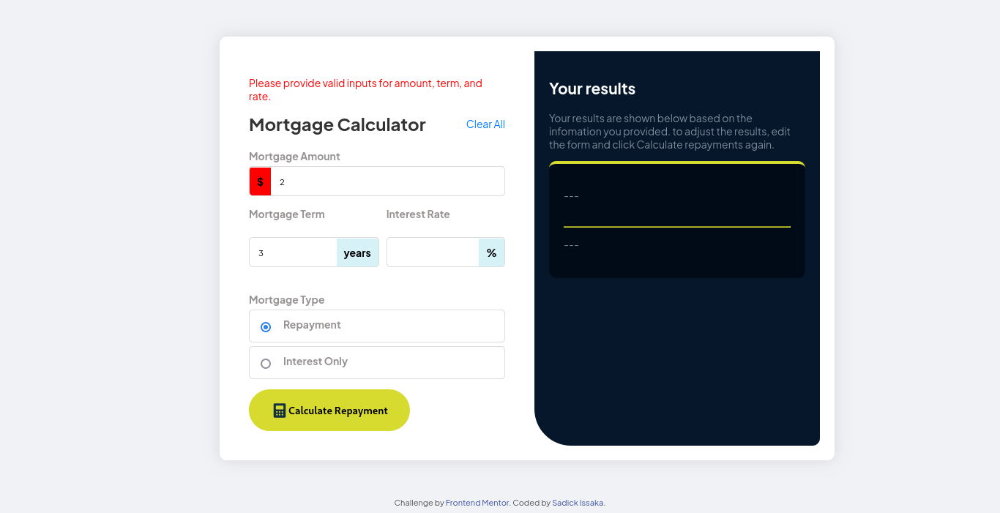

# Frontend Mentor - Mortgage repayment calculator solution

This is a solution to the [Mortgage repayment calculator challenge on Frontend Mentor](https://www.frontendmentor.io/challenges/mortgage-repayment-calculator-Galx1LXK73). Frontend Mentor challenges help you improve your coding skills by building realistic projects. 

## Table of contents

- [Overview](#overview)
  - [The challenge](#the-challenge)
  - [Screenshot](#screenshot)
  - [Links](#links)
- [My process](#my-process)
  - [Built with](#built-with)
  - [What I learned](#what-i-learned)
  - [Continued development](#continued-development)
- [Author](#author)

**Note: Delete this note and update the table of contents based on what sections you keep.**

## Overview

### The challenge

Users should be able to:

- Input mortgage information and see monthly repayment and total repayment amounts after submitting the form
- See form validation messages if any field is incomplete
- Complete the form only using their keyboard
- View the optimal layout for the interface depending on their device's screen size
- See hover and focus states for all interactive elements on the page

### Screenshot

### Links

- Solution URL: [source code](https://github.com/Sadick14/mortgage-calculator.git)
- Live Site URL: [Add live site URL here](https://your-live-site-url.com)

## My process

### Built with

- Semantic HTML5 markup
- CSS custom properties
- JavaScripts

### What I learned

I learnt a lot from how to use the radio input to make decisions in the javascripts and also learnt about the formular for calculating mortgage. Realy an eye opene

### Continued development

I want to continue building up my javascript and css speed....

## Author

- Website - [Sadick Issaka](https://www.your-site.com)
- Frontend Mentor - [@Sadick14](https://www.frontendmentor.io/profile/Sadick14)
- Twitter - [@Sadick_Issaka](https://www.twitter.com/yourusername)

